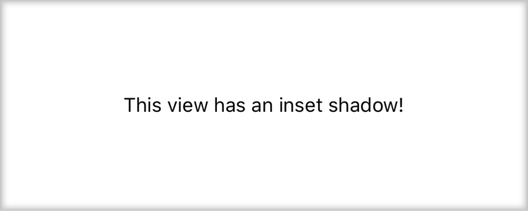

[](https://badge.fury.io/js/@wave909%2Freact-native-inset-shadow)

# @wave909/react-native-inset-shadow
Inset shadows for react native components

Fork of https://github.com/rohailaltaf/react-native-inset-shadow that adds support for:
 * Full Android styling
 * TypeScript

<p align="left">

</p>

## Setup

This library is available on npm, install it with: `npm i @wave909/react-native-inset-shadow` or `yarn add @wave909/react-native-inset-shadow`

## Usage

```js
import InsetShadow from 'react-native-inset-shadow'
import { Text, View } from 'react-native' 

const ViewWithInsetShadow = () => {
  return (
    <View style={{ height: 150 }}>
      <InsetShadow>
        <View style={{ flex: 1, justifyContent: 'center', alignSelf: 'center'}}>
          <Text>This view has an inset shadow!</Text>
        </View>
      </InsetShadow>
    </View>
  )
}
```

## Props

| Name          | Type   | Default | Description                                                              |
| ------------- | ------ | ------- | ------------------------------------------------------------------------ |
| children      | node   | null    | **(Required)** child components to sit inside the view                   |
| left          | bool   | true    | (Optional) show left inset shadow?                                       |
| top           | bool   | true    | (Optional) show top inset shadow?                                        |
| right         | bool   | true    | (Optional) show right inset shadow?                                      |
| bottom        | bool   | true    | (Optional) show bottom inset shadow?                                     |
| shadowColor   | string | black   | (Optional) shadow color                                                  |
| shadowOffset  | number | 1       | (Optional) how much to offset the shadow on the horizontal/vertical axis |
| shadowOpacity | number | 0.5     | (Optional) shadow opacity                                                |
| shadowRadius  | number | 3       | (Optional) shadow radius                                                 |
| elevation     | number | 5       | (Optional) shadow elevation for android                                  |
| containerStyle| object | {}      | (Optional) style for the container                                       |
